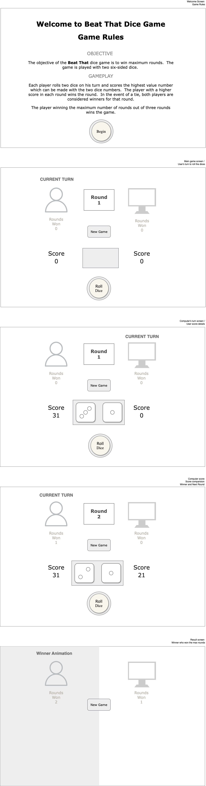

# Game Title

Beat That dice game

# Game Objective

The objective is to win maximum rounds. The game is played with two six-sided dice.

# Gameplay Instructions

Each player rolls dice on his turn and scores the highest value number which can be made with the two dice numbers. The player with a higher score in each rounds wins the round.

The player winning the maximum number of rounds out of three rounds wins the game.

# Game link

[Beat That Dice Game](https://zala-dev.github.io/dice-game/)

# Wireframe

# Technologies used

- HTML
- CSS
- JavaScript

---

# User story

- I want to see clear instructions on how to play the game in order to understand the rules and objective easily.
- I want to roll two dice together so I can see values I get on each dice.
- I want program to choose the highest combination from the two dice I rolled.
- I want to see my score on each round of the game.
- I want to see the number of rounds won by each player.
- I want to know if I have won or lost at the end of the last round.
- I want option to reset / start a new game without refreshing the page.
- I want the game to be responsive so that I can play it on different devices.
- OPTIONAL: I want the game to have sound effects on each dice roll.

---

# Core Game

- Basic game (Player V/s Computer)
- Display score
- Display rounds won
- Display winner
- New Game/Reset

---

# TO-DO

- [x] Setup File / Folder Structure
- [x] Upload dice images to assets -> images folder
- [x] Upload wireframes assets -> wireframe folder
- [x] Setup HTML
- [x] Setup CSS
- [x] Write media query for responsive design
- [x] Define Model variables - application state
- [x] Define View variables - dom/ui
- [x] Define View functions
- [x] Define Controller functions
- [x] Render initial screen
- [x] Render dice
- [x] Render player turn
- [x] Render who won the round and update the rounds won score
- [x] Render final result and winner
- [x] Refactor to improve code readability and maintainability
- [x] Publish application on Github pages

---

# Future Enhancement

- User sign in and sign up functionality.
- Provide an option to choose number of game rounds from 5, 10, and 15.
- Store user information including score and rounds won to an external database.
- Display global leadership board.
- Ability to toggle Light / Dark theme.
- Implement realtime Player v/s Player mode.
